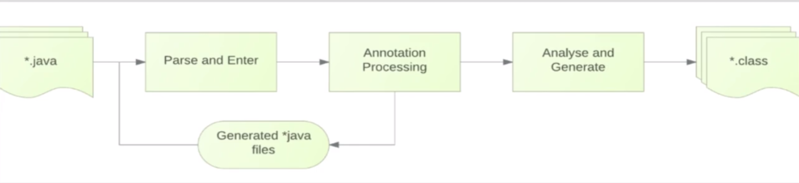

# ButterKnife

[toc]

## 一、概述

ButterKnife是通过注解来进行动态注入，可以减少使用findViewById、setOnClickListener等。相比于一些运行时注解处理框架，ButterKnife采用APT在编译时动态生成代码，避免了运行时注解处理框架在运行时采用大量的反射带来的性能问题，当然这会增加编译时的成本。

## 二、基础知识

### 2.1 注解

#### 2.1.1普通注解

@Override：表明当前方法定义，需要覆盖父类的方法。

@Deprecated：表明已过时。

@SuppressWarnings：表明需要忽略编译器的警告信息。

#### 2.1.2 元注解

定义：元注解是用来注解其他注解的注解。

@Document：用这个注解标注的注解，表明该注解应该被java doc工具所记录。

@Target：表明注解的使用范围

@Retention：描述注解的生命周期

@Inherited：表明注解是可继承的。

#### 2.1.3 自定义注解

```java
@Documented
@Target(ElementType.TYPE)
@Retention(RetentionPolicy.RUNTIME)
@Inherited
public @interface MetaTest {
}
```

## 三、APT工作原理

注解处理器（Annotation Processor）是javac的一个工具。利用注解处理器我们可以在编译时扫描和处理所需要的注解。

每一个处理器都是继承于AbstractProcessor。

**AbstractProcessor相关介绍**

```java
public synchronized void init(ProcessingEnvironment processingEnv) {
        if (initialized)
            throw new IllegalStateException("Cannot call init more than once.");
        Objects.requireNonNull(processingEnv, "Tool provided null ProcessingEnvironment");

        this.processingEnv = processingEnv;
        initialized = true;
    }
```

该方法中的ProcessingEnvironment会提供很多工具类，这些工具类包括：

- **Elements**：处理Element的工具类，其中Element代表的是java源代码
- **Types：**处理TypeMirror和TypeElement的工具类。TypeMirror和TypeElement就代表源代码当中的类型元素
- **Filer：**创建文件

Process方法就相当于每个java文件的main方法，在该方法中处理相关注解，生成对应的java文件。

```java
public abstract boolean process(Set<? extends TypeElement> annotations,
                                    RoundEnvironment roundEnv);
```


**AbstractProcessor如何生成字节码文件**



- 首先输入java源文件；
- 经过解析，进入到Annotation Processor工具中进行注解处理；
- 生成java源文件，并最终生成class文件

总之，Annotation Processor就是把标记了注解的类，变量等作为输入内容，经过注解处理器处理，生成想要生成的java代码。