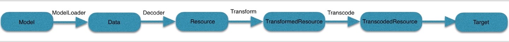

[toc]

## Glide几个基本概念

**Model：**表示的是数据来源，url，文件，资源id。

**Data：**数据源中获取到model后，会加工成原始数据，一般是inputstream，而负责从数据源中获取原始数据的叫做ModelLoader。

**Resource：**负责从刚才得到的原始数据进行解码，解码之后的资源就叫做Resource，负责解码的就叫做ResourceDecoder。

**TransformedResource：**把Resource进行变换，ResourceTransform来进行转换，转换后的资源就叫做TransformedResource。

**TranscodedResource：**转码，Glide除了能加载静态图之外，还能加载动态图，但是解码之后的bitmap和gifDrawable,其类型不是统一的，为了方便处理，glide就会把bitmap转换成glideBitmapDrawable，这样类型就统一了，负责转码的角色叫 transcode，而转码之后的就叫做TranscodedResource。

**Target：**将图片显示在目标上，Glide将我们显示的目标封装成Target。

下图是整个glide的整个加载图片的流程：




## Glide源码分析

1. Glide.with(Context context)
    
    with方法是为了获取到RequestManager对象，管理我们的图片请求流程。 其内部通过获取到一个无界面的Fragment添加到Activity，并且将RequestManager与Application或Fragment的周期进行绑定。
    
    
2. load(String url)
        这个方法返回DrawableTypeRequest，这个对象代表着所有Glide中加载图片的所有request请求;
        这个方法其实都是做的一些初始化工作，返回一个DrawableTypeRequest对象，其初始化配置工作其实都是在
        GenericRequestBuilder中配置完成的。

    RequestManager作用：
        （1）管理我们的请求
        （2）完成Glide对象的构造，控制Glide请求过程中的各种方法
        （3）通过RequestManager，我们就可以去控制整个界面的生命周期的监听，也就是说，它是用来监听整个组件的生命周期的
             根据生命周期进行图片的操作
             
 ```
 RequestManager fragmentGet(Context context, android.app.FragmentManager fm) {
         RequestManagerFragment current = getRequestManagerFragment(fm);
         RequestManager requestManager = current.getRequestManager();
         if (requestManager == null) {
             requestManager = new RequestManager(context, current.getLifecycle(), current.getRequestManagerTreeNode());
             current.setRequestManager(requestManager);
         }
         return requestManager;
     }
 ```
    RequestManagerFragment对应一个RequestManager
    
    RequestTracker作用：
        负责跟踪整个图片请求周期，也可以作为取消、重启一些失败的图片请求的作用
        
    DrawableTypeRequest作用：
        
        主要将我们要加载的图片强制转换成bitmap或者gif，方法是asBitmap(),asGif()

3. into(ImageView view)
```java
public class GenericRequestBuilder<ModelType, DataType, ResourceType, TranscodeType> implements Cloneable {
    //...............................
    
    public Target<TranscodeType> into(ImageView view) {
            Util.assertMainThread();
            if (view == null) {
                throw new IllegalArgumentException("You must pass in a non null View");
            }
    
            if (!isTransformationSet && view.getScaleType() != null) {
                switch (view.getScaleType()) {
                    case CENTER_CROP:
                        applyCenterCrop();
                        break;
                    case FIT_CENTER:
                    case FIT_START:
                    case FIT_END:
                        applyFitCenter();
                        break;
                    //$CASES-OMITTED$
                    default:
                        // Do nothing.
                }
            }
    
            return into(glide.buildImageViewTarget(view, transcodeClass));
        }
    //...............................

}
```
        into方法的实现最终都是在GenericRequestBuilder当中

4. Glide缓存  
(1)内存缓存，防止频繁地将图片读取到内存当中；
    LruCache:近期最少使用的算法，将最近所使用到的对象的引用存储在LinkedHashMap上，并且将最近最少使用
            的对象在缓存池达到阈值之前清除掉。
    弱引用：
   
    

(2)硬盘缓存，防止重复地从网络下载我们所需要的图片。

5. Bitmap面试题
(1)为什么Bitmap会导致OOM?     
    .使用ListView，GridView，大量加载图片容易导致OOM，监控ListView，RecyclerView的滑动，只有当其停止的
    时候再去加载图片，滑动的时候不加载图片。
    .图片分辨率越高，消耗的内存越大，图片Bitmap所占用的内存=图片长度 x 图片宽度 x 一个像素点占用的字节数
    .VM值上线dalvik.vm.heapgrowthlimit
(2)Bitmap的4种优化策略？
    .对图片质量进行压缩；
```java
public class BitmapDemo {
    /**
     * 压缩Bitmap图片质量
     *
     * @param image Bitmap
     * @return 压缩以后的Bitmap
     */
    private Bitmap compressImage(Bitmap image) {
        ByteArrayOutputStream baos = new ByteArrayOutputStream();
        image.compress(Bitmap.CompressFormat.JPEG, 100, baos);
        int options = 100;
        while (baos.toByteArray().length / 1024 > 100) {
            baos.reset();
            ;
            image.compress(Bitmap.CompressFormat.JPEG, options, baos);
            options -= 10;
        }
        ByteArrayInputStream isBm = new ByteArrayInputStream(baos.toByteArray());
        Bitmap bitmap = BitmapFactory.decodeStream(isBm, null, null);
        return bitmap;
    }

}
```
    .图片按比例进行压缩；
```java
public class BitmapDemo {

    /**
     * 根据宽高比例来压缩
     * @param image 待压缩的Bitmap
     * @return 返回压缩以后的Bitmap
     */
    private Bitmap compBitmapInSize(Bitmap image) {
        ByteArrayOutputStream baos = new ByteArrayOutputStream();
        ByteArrayInputStream isBm;
        BitmapFactory.Options options = new BitmapFactory.Options();
        options.inJustDecodeBounds = true;//只返回宽和高，不必分配内存
        Bitmap bitmap;
        int w = options.outWidth;
        int h = options.outHeight;
        float hh = 1280f;//这里设置高度为1280f
        float ww = 720f;//这里设置宽度为720f
        int be = 1;
        if (w > h && 2 > ww) {
            be = (int) (options.outWidth / ww);

        } else if (w < h && h > hh) {
            be = (int) (options.outHeight / hh);
        }
        if (be <= 0) {
            be = 1;
        }
        options.inSampleSize = be;
        options.inJustDecodeBounds = false;
        isBm = new ByteArrayInputStream(baos.toByteArray());
        bitmap = BitmapFactory.decodeStream(isBm, null, options);
        return bitmap;
    }
}
```
    .关于Bitmap的recycle方法；
```java
public final class Bitmap implements Parcelable {
    /**
         * Free the native object associated with this bitmap, and clear the
         * reference to the pixel data. This will not free the pixel data synchronously;
         * it simply allows it to be garbage collected if there are no other references.
         * The bitmap is marked as "dead", meaning it will throw an exception if
         * getPixels() or setPixels() is called, and will draw nothing. This operation
         * cannot be reversed, so it should only be called if you are sure there are no
         * further uses for the bitmap. This is an advanced call, and normally need
         * not be called, since the normal GC process will free up this memory when
         * there are no more references to this bitmap.
         */
        public void recycle() {
            if (!mRecycled && mNativePtr != 0) {
                if (nativeRecycle(mNativePtr)) {
                    // return value indicates whether native pixel object was actually recycled.
                    // false indicates that it is still in use at the native level and these
                    // objects should not be collected now. They will be collected later when the
                    // Bitmap itself is collected.
                    mNinePatchChunk = null;
                }
                mRecycled = true;
            }
        }
}
   
```
    .捕获异常。
```java
public class BitmapDemo {
        /**
         * 伪代码，捕获异常
         */
        public void handleBitmapCrash(){
            Bitmap bitmap;
            String path ="xxx/xxx/xxx";
            try {
                //实例化Bitmap
                bitmap=BitmapFactory.decodeFile(path);
            }catch (OutOfMemoryError e){
                e.printStackTrace();
            }
        }
}

```

6. 三级缓存/Lru算法   
    (1)内存 - 本地 - 网络
    (2)内存缓存是如何实现的？
    主要包括缓存的添加，获取，删除三个操作。
    (3)LRU(Least Recently Used)缓存算法
```java
public class LruCache<K, V> {
    /**
         * Returns the value for {@code key} if it exists in the cache or can be
         * created by {@code #create}. If a value was returned, it is moved to the
         * head of the queue. This returns null if a value is not cached and cannot
         * be created.
         */
        public final V get(K key) {
            if (key == null) {
                throw new NullPointerException("key == null");
            }
    
            V mapValue;
            synchronized (this) {
                mapValue = map.get(key);
                if (mapValue != null) {
                    hitCount++;
                    return mapValue;
                }
                missCount++;
            }
    
            /*
             * Attempt to create a value. This may take a long time, and the map
             * may be different when create() returns. If a conflicting value was
             * added to the map while create() was working, we leave that value in
             * the map and release the created value.
             */
    
            V createdValue = create(key);
            if (createdValue == null) {
                return null;
            }
    
            synchronized (this) {
                createCount++;
                mapValue = map.put(key, createdValue);
    
                if (mapValue != null) {
                    // There was a conflict so undo that last put
                    map.put(key, mapValue);
                } else {
                    size += safeSizeOf(key, createdValue);
                }
            }
    
            if (mapValue != null) {
                entryRemoved(false, key, createdValue, mapValue);
                return mapValue;
            } else {
                trimToSize(maxSize);
                return createdValue;
            }
        }
        
        /**
             * Caches {@code value} for {@code key}. The value is moved to the head of
             * the queue.
             *
             * @return the previous value mapped by {@code key}.
             */
            public final V put(K key, V value) {
                if (key == null || value == null) {
                    throw new NullPointerException("key == null || value == null");
                }
        
                V previous;
                synchronized (this) {
                    putCount++;
                    size += safeSizeOf(key, value);
                    previous = map.put(key, value);
                    if (previous != null) {
                        size -= safeSizeOf(key, previous);
                    }
                }
        
                if (previous != null) {
                    entryRemoved(false, key, previous, value);
                }
        
                trimToSize(maxSize);
                return previous;
            }
            
            /**
                 * Remove the eldest entries until the total of remaining entries is at or
                 * below the requested size.
                 *
                 * @param maxSize the maximum size of the cache before returning. May be -1
                 *            to evict even 0-sized elements.
                 */
                public void trimToSize(int maxSize) {
                    while (true) {
                        K key;
                        V value;
                        synchronized (this) {
                            if (size < 0 || (map.isEmpty() && size != 0)) {
                                throw new IllegalStateException(getClass().getName()
                                        + ".sizeOf() is reporting inconsistent results!");
                            }
            
                            if (size <= maxSize) {
                                break;
                            }
            
                            Map.Entry<K, V> toEvict = map.eldest();
                            if (toEvict == null) {
                                break;
                            }
            
                            key = toEvict.getKey();
                            value = toEvict.getValue();
                            map.remove(key);
                            size -= safeSizeOf(key, value);
                            evictionCount++;
                        }
            
                        entryRemoved(true, key, value, null);
                    }
                }
}
```

LruCache算法原理
    (1)LruCache中将LinkedHashMap的顺序设置为LRU顺序实现LRU缓存；
    (2)每次调用get则将该对象移动到链表的尾端。调用put插入新的对象也是存储在链表的尾端；
    (3)当内存缓存达到设定的最大值时，将链表头部的对象(近期最少用到的)移除。