[toc]

## 一、问题概览

- Android基础网络编程：socket、HttpClient和HttpURLConnection？
- 了解websocket吗？知道和socket的区别吗？okhttp是如何处理websocket的相关问题的？
- Http如何处理缓存？OkHttp如何处理缓存相关问题？
- 断点续传的原理？如何实现？OkHttp中如何实现相关问题？
- 多线程下载原理okhttp如何实现？
- 文件上传如何做？原理？okhttp如何完成文件上传？
- json数据如何解析？okhttp如何解析json类型的数据？
- okhttp如何处理https?

## 二、问题解答

### 2.1 Android基础网络编程：socket、HttpClient和HttpURLConnection？

#### 2.1.1 Socket

**Socket是什么？**

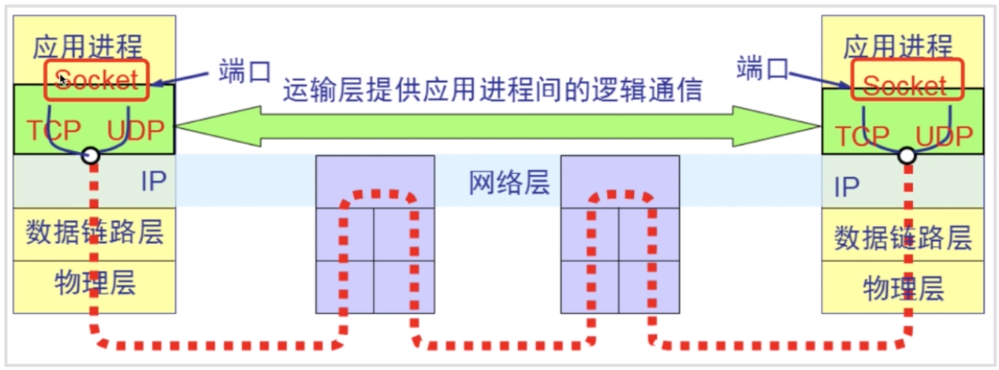

Socket是基于应用程序和传输层之间抽象出来的，应用程序可以通过Socket进行发送或接收数据，同时使用Socket可以将应用程序添加到网络当中。简而言之，Socket就是给应用程序提供了一个和外部通信的端口，并为通信的两端提供了数据的传输通道。

总而言之，

- Socket是一个对TCP/IP协议进行封装的编程调用接口，也就是常说的API。注意：Socket不是协议，只是一个编程调用接口，属于传输层；
- 承兑出现，一对套接字：包括ip地址和端口号。


**Socket通信模型？**

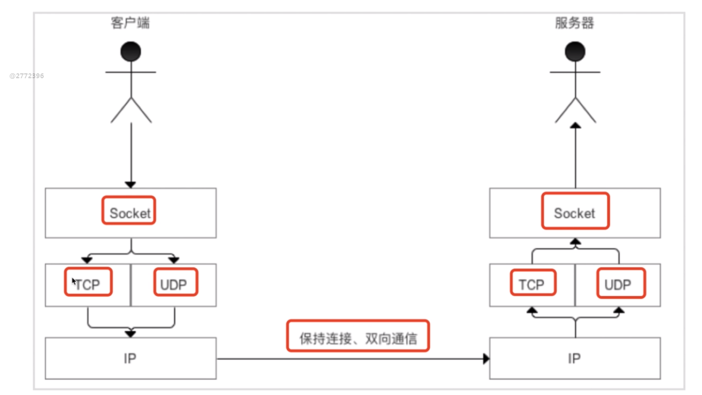

Socket通信模型分为两种，

- 基于TCP，采用字节流的形式，提供可靠的字节流服务
- 基于UDP，采用数据报文的形式提供数据，然后打包发送服务


**Socket与Http对比？**

要弄明白http和socket，首先要熟悉网络七层：**物数网传会表应**，如下图


HTTP 协议:超文本传输协议，对应于应用层，用于如何封装数据.

TCP/UDP 协议:传输控制协议，对应于传输层，主要解决数据在网络中的传输。

IP 协议:对应于网络层，同样解决数据在网络中的传输。

传输数据的时候只使用 TCP/IP 协议(传输层)，如果没有应用层来识别数据内容，传输后的协议都是无用的。

应用层协议很多 FTP,HTTP,TELNET等，可以自己定义应用层协议。

web 使用 HTTP 作传输层协议，以封装 HTTP 文本信息，然后使用 TCP/IP 做传输层协议，将数据发送到网络上。


**http 为短连接：**客户端发送请求都需要服务器端回送响应.请求结束后，主动释放链接，因此为短连接。通常的做法是，不需要任何数据，也要保持每隔一段时间向服务器发送"保持连接"的请求。这样可以保证客户端在服务器端是"上线"状态。

HTTP连接使用的是"请求-响应"方式，不仅在请求时建立连接，而且客户端向服务器端请求后，服务器才返回数据。

 

**Socket 连接**

要想明白 Socket，必须要理解 TCP 连接。

TCP 三次握手：握手过程中并不传输数据，在握手后服务器与客户端才开始传输数据，理想状态下，TCP 连接一旦建立，在通讯双方中的任何一方主动断开连接之前 TCP 连接会一直保持下去。

Socket 是对 TCP/IP 协议的封装，Socket 只是个接口不是协议，通过 Socket 我们才能使用 TCP/IP 协议，除了 TCP，也可以使用 UDP 协议来传递数据。

创建 Socket 连接的时候，可以指定传输层协议，可以是 TCP 或者 UDP，当用 TCP 连接，该Socket就是个TCP连接，反之。


**Socket 原理**

*Socket 连接,至少需要一对套接字，分为 clientSocket，serverSocket 连接分为3个步骤:*

*(1) 服务器监听:服务器并不定位具体客户端的套接字，而是时刻处于监听状态；*

*(2) 客户端请求:客户端的套接字要描述它要连接的服务器的套接字，提供地址和端口号，然后向服务器套接字提出连接请求；*

*(3) 连接确认:当服务器套接字收到客户端套接字发来的请求后，就响应客户端套接字的请求,并建立一个新的线程,把服务器端的套接字的描述发给客户端。一旦客户端确认了此描述，就正式建立连接。而服务器套接字继续处于监听状态，继续接收其他客户端套接字的连接请求.*

**Socket为长连接**

通常情况下Socket 连接就是 TCP 连接，因此 Socket 连接一旦建立,通讯双方开始互发数据内容，直到双方断开连接。在实际应用中，由于网络节点过多，在传输过程中，会被节点断开连接，因此要通过轮询高速网络，该节点处于活跃状态。

 

很多情况下，都是需要服务器端向客户端主动推送数据，保持客户端与服务端的实时同步。

若双方是 Socket 连接，可以由服务器直接向客户端发送数据。

若双方是 HTTP 连接，则服务器需要等客户端发送请求后，才能将数据回传给客户端。

因此，客户端定时向服务器端发送请求，不仅可以保持在线，同时也询问服务器是否有新数据，如果有就将数据传给客户端。


在Android当中，存在两种通信方式，

- Http通信

  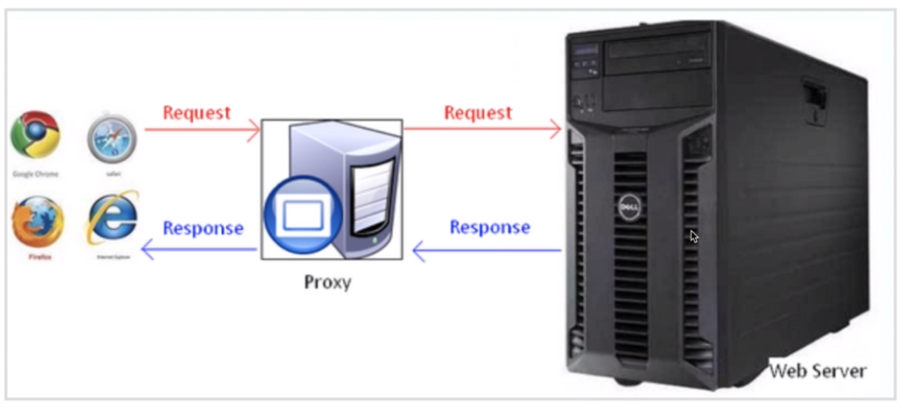

  Http通信是**基于请求响应方式**的，当我们需要网络请求时，会建立一个连接通道，通过Proxy传递请求给服务器。服务器接收到Request对象以后，通过Proxy传递Response到客户端。

- Socket通信

  Socket是基于TCP/IP协议的，当双方建立连接以后就可以直接进行数据传输了。

Http：采用请求-响应方式。HTTP协议属于应用层。

Socket：采用客户端主动发送数据的方式，Socket属于传输层。

**Socket如何实现？**

代码未实现

#### 2.1.2 HttpClient和HttpURLConnection

代码未实现


### 2.2 了解websocket吗？知道和socket的区别吗？okhttp是如何处理websocket的相关问题的？

websocket分为两种，一种是短轮询，一种是长轮询。

**websocket通信模型**

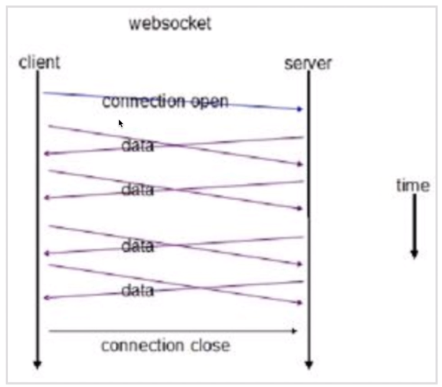

相比传统的http请求，客户端和服务端一旦通过websocket建立好连接之后，这两端就可以不断通信，是一种全双工的通信模式，也就是说客户端可以向服务端发送数据，服务端也可以向客户端发送数据。只要这个链接不关闭，都可以相互发送数据。这也是websocket优点之一。


**短轮询**

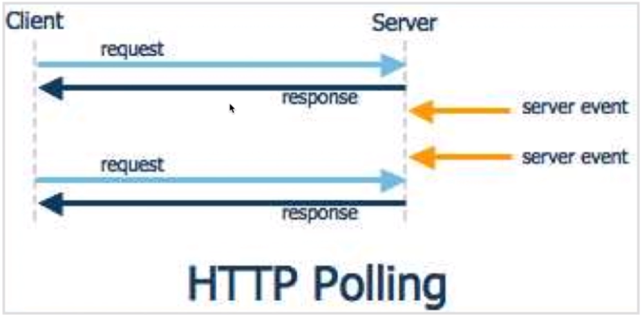

**短轮询缺点**

在某个时间段，server没有更新数据，但client仍然每隔一段时间发送请求来询问，所以这段时间内的询问是无效的


**长轮询**

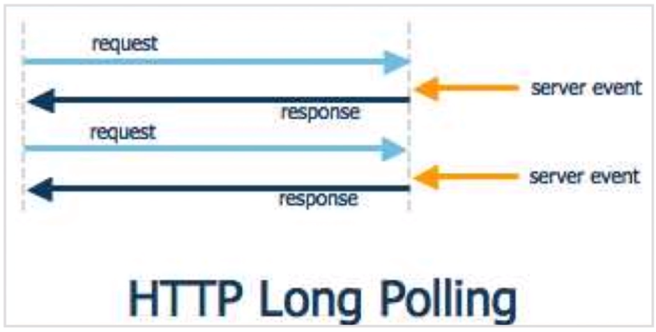

客户端发送request到服务端，服务端检测如果没有数据更新，则会保持这个长连接，如果有数据更新，则会返回相应的response给客户端。

**轮询缺点**

- 浪费带宽（Http Head部分比较大）
- 消耗服务器CPU占用

**websocket和Http有什么关系**

- 与HTTP同等的网络协议
- 双向通信协议

**websocket和http有什么关系**

- Socket其实并不是一个协议
- WebSocket是一种协议

**WebSocket总结**

- 本质上是一个基于TCP的协议
- 向服务器发起一个HTTP请求/"Upgrade:WebSocket"
- 服务端解析这些附加的头信息


```java
public class WebSocketDemo {

    private Handler handler = new Handler(){
        @Override
        public void handleMessage(@NonNull Message msg) {
            super.handleMessage(msg);
        }
    };

    private void connect(){
        OkHttpClient client = new OkHttpClient();

        Request request = new Request.Builder().url("www.websocket.com").build();

        EchoWebSocketListener listener = new EchoWebSocketListener();
        client.newWebSocket(request,listener);

        client.dispatcher().executorService().shutdown();
    }

    private class EchoWebSocketListener extends WebSocketListener{
        public EchoWebSocketListener() {
            super();
        }

        @Override
        public void onOpen(WebSocket webSocket, Response response) {
            webSocket.send("hello world");
            webSocket.close(1000,"再见");
        }

        @Override
        public void onMessage(WebSocket webSocket, String text) {
            handler.sendEmptyMessage(0);
        }

        @Override
        public void onMessage(WebSocket webSocket, ByteString bytes) {
        }

        @Override
        public void onClosing(WebSocket webSocket, int code, String reason) {
            webSocket.close(1000,null);
        }

        @Override
        public void onClosed(WebSocket webSocket, int code, String reason) {

        }

        @Override
        public void onFailure(WebSocket webSocket, Throwable t, Response response) {
        }
    }
}
```

### 2.3 Http如何处理缓存？OkHttp如何处理缓存相关问题？

#### 2.3.1 Http缓存

**强制缓存**

- Expires

  - Expires的值为服务端返回的到期时间。下一次请求时如果时间小于服务端返回的过期时间，那么这时候就会直接使用缓存数据。不过Expires是Http 1.0经常用的。现在浏览器默认使用Http 1.1，该字段基本不用。

    问题：到期时间由服务端生成的，和客户端的时间存在误差，就有可能造成缓存读取的误差。

- Cache-Control

  - Cache-Control是由服务器返回的Response中添加的头信息。目的就是告知客户端是应该从本地获取缓存数据还是从服务端请求数据。

    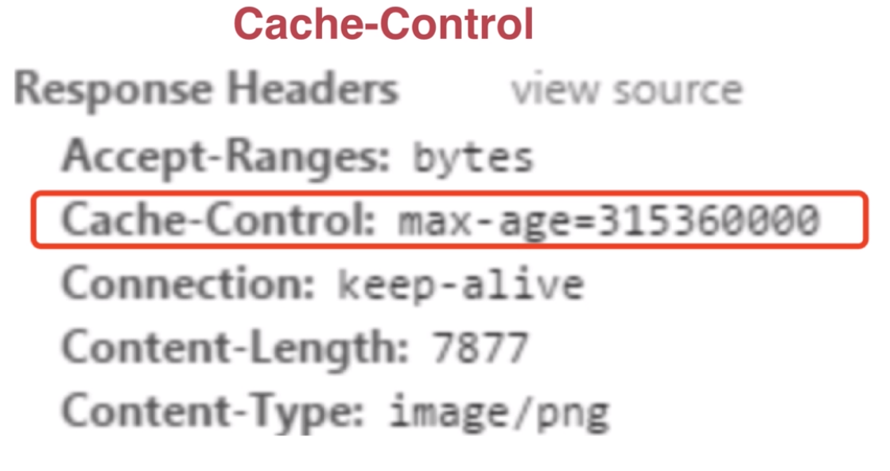

Cache-Control后面可以跟多少个取值呢？

- private：表示客户端可以缓存
- public：表示客户端和代理服务器都可以缓存
- max-age：表示缓存内容将在多少秒之后失效
- no-cache：表示强制缓存无法去处理我们的缓存
- no-store：表示所有的内容都不用缓存

**对比缓存**

- 首先需要进行比较判断是否可以使用缓存。

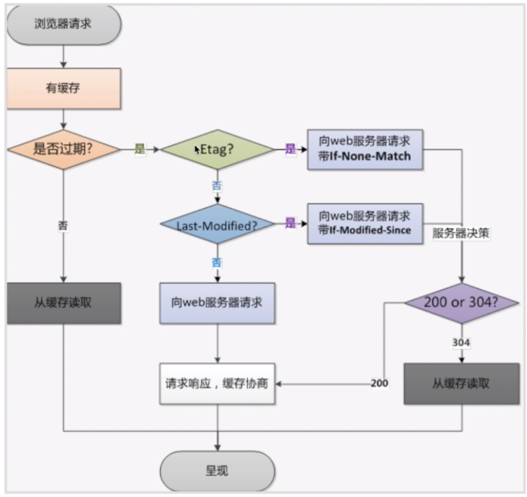

- 服务器会将缓存标识与数据一起返回给客户端

**Etag：**服务器响应请求时，告诉浏览器当前资源在服务器的唯一标识。

**If-None-Match：**再次请求服务器时，通过此字段通知服务器客户端缓存数据的唯一标识。

注意：Etag和If-None-Match是成对出现的。

**Last-Modified：**服务器在响应请求时，告诉浏览器资源的最后修改时间。

**If-Modified-Since：**再次请求服务器时，通过此字段通知服务器上次请求时，服务器返回的资源最后修改时间。

### 2.4 断点续传的原理？如何实现？OkHttp中如何实现相关问题？

断点续传：从文件已经下载的地方开始继续下载。

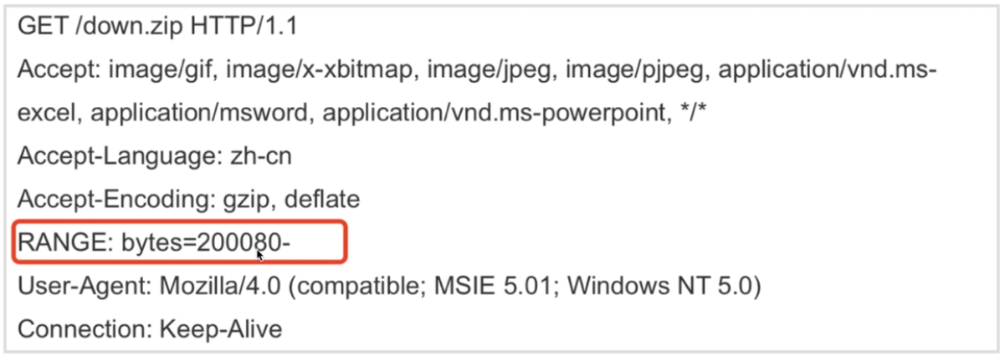

```java
public class BreadPointDownload {
    public void doBreakPointDownload() {
        URL url;
        try {
            url = new URL("http://www.sjtu.edu.cn.down.zip");
            HttpURLConnection httpConnection = (HttpURLConnection) url.openConnection();
            httpConnection.setRequestProperty("RANGE", "bytes=2000080");
            InputStream input = httpConnection.getInputStream();

            RandomAccessFile oSavedFile = new RandomAccessFile("down.zip", "rw");
            long nPos = 2000080;
            oSavedFile.seek(nPos);
            byte[] b = new byte[1024];
            int nRead;
            while ((nRead = input.read(b, 0, 1024)) > 0) {
                oSavedFile.write(b, 0, nRead);
            }
        } catch (MalformedURLException e) {
            e.printStackTrace();
        } catch (IOException e) {
            e.printStackTrace();
        }
    }

    public void doDownloadWithOkHttp() {
        InputStream is;
        RandomAccessFile savedFile;
        File file;
        // 记录已经下载的文件长度
        long downloadLength = 0;
        String downloadUrl = "www.xxx.xxx.txt";
        String fileName = downloadUrl.substring(downloadUrl.lastIndexOf("."));
        String directory = Environment.getExternalStoragePublicDirectory(Environment.DIRECTORY_DOWNLOADS).getAbsolutePath();
        file = new File(directory + fileName);
        if (file.exists()) {
            downloadLength = file.length();
        }
        long contentLength = getContentLength(downloadUrl);
        
        OkHttpClient client = new OkHttpClient();
        Request request = new Request.Builder().addHeader("RANGE", "bytes=" + downloadLength + "-").url(downloadUrl).build();
        try {
            Response response = client.newCall(request).execute();
            if (response != null) {
                is = response.body().byteStream();
                savedFile = new RandomAccessFile(file, "rw");
                savedFile.seek(downloadLength);
                byte[] b = new byte[1024];
                int total = 0;
                int len;
                while ((len = is.read(b)) != -1) {
                    total += len;
                    savedFile.write(b, 0, len);
                    // 计算已经下载的百分比
                    int progress = (int) ((total + downloadLength) * 100 / contentLength);
                }
            }
        } catch (IOException e) {
            e.printStackTrace();
        }
    }

    private long getContentLength(String downloadUrl) {
        return 0;
    }
}
```


### 2.5 多线程下载原理okhttp如何实现？

多线程下载：每个线程负责下载文件的一部分。当各个线程将自己所负责部分下载完成以后，整个文件就下载完成了。

注意：以下代码片段存在问题，可参考其中的设计思想

```java
public class MultiThreadDownload {
    public void download(String urlPath, String targetFilePath, String child, int threadCount) throws Exception {
        URL url = new URL(urlPath);
        HttpURLConnection connection = (HttpURLConnection) url.openConnection();
        connection.setRequestMethod("GET");
        connection.setConnectTimeout(10000);
        int code = connection.getResponseCode();
        if (code == 200) {
            // 获取资源大小
            int contentLength = connection.getContentLength();
            // 在本地创建一个与资源同样大小的文件来占位
            RandomAccessFile randomAccessFile = new RandomAccessFile(new File(targetFilePath, child), "rw");
            randomAccessFile.setLength(contentLength);

            int blockSize = contentLength / threadCount;
            for (int threadId = 0; threadId < threadCount; threadId++) {
                // 左闭右开
                int startIndex = threadId * blockSize;
                int endIndex = (threadId + 1) * blockSize - 1;
                if (threadId == threadCount - 1) {
                    endIndex = contentLength - 1;
                }
                new DownloadThread(urlPath, targetFilePath, threadId, startIndex, endIndex).start();// 开启线程下载
            }
        }
    }

    private class DownloadThread extends Thread {
        private final String urlPath;
        private final String targetFilePath;
        private final int threadId;
        private int startIndex;
        private final int endIndex;

        public DownloadThread(String urlPath, String targetFilePath, int threadId, int startIndex, int endIndex) {
            this.urlPath = urlPath;
            this.targetFilePath = targetFilePath;
            this.threadId = threadId;
            this.startIndex = startIndex;
            this.endIndex = endIndex;
        }

        @Override
        public void run() {
            System.out.println("线程" + threadId + "开始下载");
            try {
                URL url = new URL(urlPath);
                File downloadThreadFile = new File(targetFilePath, "download_" + threadId + ".dt");
                RandomAccessFile downThreadStream;
                if (downloadThreadFile.exists()) {
                    downThreadStream = new RandomAccessFile(downloadThreadFile, "rwd");
                    String startIndex_str = downThreadStream.readLine();
                    if (!TextUtils.isEmpty(startIndex_str)) {
                        this.startIndex = Integer.parseInt(startIndex_str) - 1;
                    }
                } else {
                    downThreadStream = new RandomAccessFile(downloadThreadFile, "rwd");
                }

                HttpURLConnection connection = (HttpURLConnection) url.openConnection();
                connection.setRequestMethod("GET");
                connection.setConnectTimeout(10000);
                connection.setRequestProperty("RANGE", "bytes=" + startIndex + "_" + endIndex);
                // 206代表部分资源请求成功
                if (connection.getResponseCode() == 206) {
                    InputStream inputStream = connection.getInputStream();
                    RandomAccessFile randomAccessFile = new RandomAccessFile(new File(targetFilePath, getFileName(url)), "rw");
                    randomAccessFile.seek(startIndex);

                    byte[] buffer = new byte[1024];
                    int length = -1;
                    int total = 0;// 记录本次下载的文件大小
                    while ((length = inputStream.read(buffer)) > 0) {
                        randomAccessFile.write(buffer, 0, length);
                        total += length;
                        downThreadStream.seek(0);
                        downThreadStream.write((startIndex + total + "").getBytes("UTF-8"));
                    }
                    downThreadStream.close();
                    inputStream.close();
                    randomAccessFile.close();
                    cleanTemp(downloadThreadFile);
                }
            } catch (Exception e) {

            }
        }

        private void cleanTemp(File downloadThreadFile) {

        }

        private String getFileName(URL url) {
            return null;
        }
    }
}
```

### 2.6 文件上传如何做？原理？okhttp如何完成文件上传？

#### 2.6.1 文件上传

- Http之contentType
- Content-Type属性指定请求和相应的HTTP内容类型。

### 2.7 json数据如何解析？okhttp如何解析json类型的数据？

json：文本形式的数据交换格式

- 传统的JSON解析
- GSON
- FastJSON


### 2.8 okhttp如何处理https?

Https是一种基于SSL/TLS的Http协议。本质上还是一种Http协议，只是在Http协议基础之上，添加了SSL/TLS握手过程，以及两者的数据加密传输。

**Http缺点**

- 所有传输的内容都是明文。那么第三方就有可能拦截服务端或客户端发送的消息，同时，客户端和服务端也无法验证对方的身份，这也是第三方可以拦截的一大原因。

**Https**

- 所有传输的内容都经过加密（对称 + 不对称）。
  - 对称加密是指加密和解密使用的密钥是同一个密钥。
  - 不对称加密和解密使用的密钥不是同一密钥。公钥和私钥
- 对称加密所使用的密钥我们可以通过非对称加密的方式发送出去。

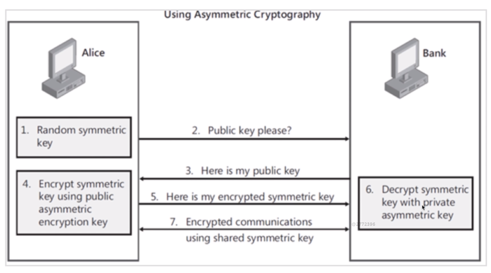

1. 客户端生成随机对称密钥rsk；
2. 客户端向服务端请求公钥pk；
3. 服务端返回pk给客户端；
4. 客户端使用公钥pk加密客户端产生的对称密钥rsk，生成encryped rsk，
5. 客户端将加密后的encryped rsk传递给服务端；
6. 服务端通过私钥pak解密encryped rsk，得到客户端的对称密钥rsk；
7. 客户端传输内容时通过对称密钥rsk对内容进行加密。


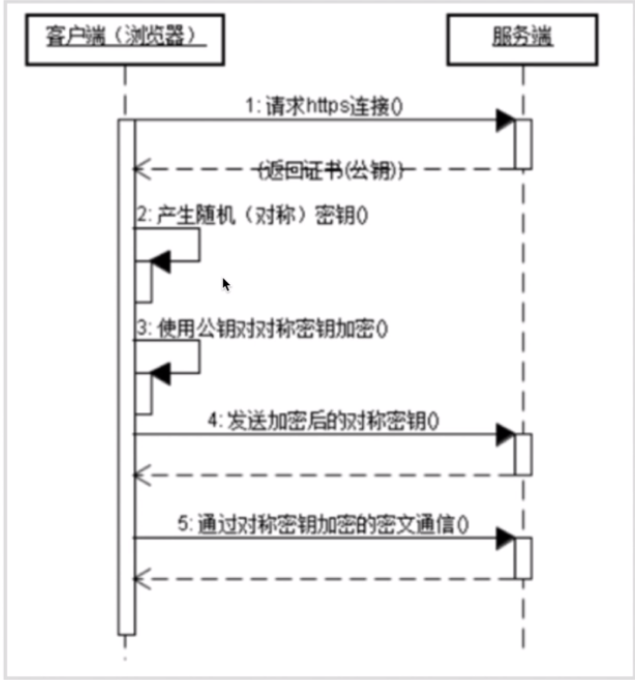

Https所涉及算法

- 不对称加密
- 对称加密
- Hash算法，用于验证客户端发送给服务端的数据的完整性。